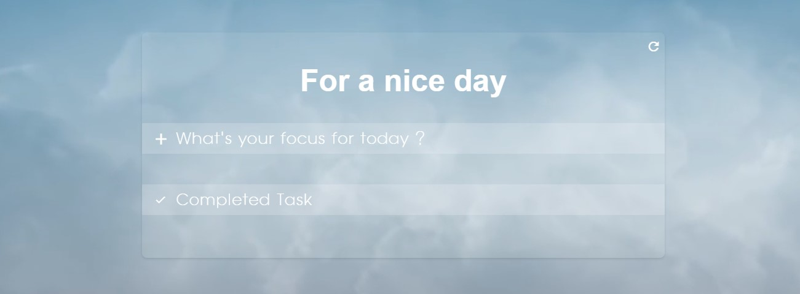
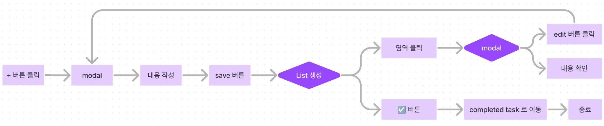

# 📋 TO DO LIST

---

## 프로젝트 정의

TO DO LIST 는 그 날 할 일을 정리해둘 수 있는 리스트를 제공해줍니다. 



최초의 화면에서는 main title 과 일정을 추가할 수 있는 목록, 그리고 완료 목록 이렇게 보여집니다. 
`+` 버튼을 통해 새로운 일정을 등록할 수 있습니다. 
버튼을 누르면 모달창이 뜨며 그 안에 내용을 기입 후 저장을 하면 진행중인 목록에 새로운 리스트가 생성됩니다. 
만약 해당 일정을 완료하였다면 체크버튼을 클릭해 완료목록으로 보낼 수 있습니다. 
완료목록으로 보낸 일정은 더 이상 수정이 불가능합니다. 
리스트가 너무 많아 정리를 하고 싶다면 맨 위의 리셋버튼을 클릭하여 전체 정리를 할 수 있습니다.

🔥 그 외 특이사항
 + 새로고침을 하더라도 리셋버튼을 누르지 않는 한 데이터는 유지됩니다.

### 설치

제공된 TO DO LIST 는 JavaScript 와 Nodejs 기반으로 구성되어있습니다.

[nodejs 다운로드 사이트](https://nodejs.org/en/)

설정되어있는 버전과 본인의 버전이 다르다면 제공된 버전으로 업그레이드 혹은 다운그레이드 해주세요.

```js
[노드 버전 확인]
node -v

[npm 버전 확인]
npm -v

[새로운 버전으로 설치하기]
n lts
n latest

[이전 버전 삭제하기]
n prune
```

---

## 기능 정의서



### 진행중인 목록 (What's your focus for today?)

#### 1) 리스트 생성
+ `+` 버튼을 클릭 합니다.
+ 클릭하면 모달창이 뜹니다. 
+ 모달창 내부에 날짜, 제목, 내용을 입력 후 save 버튼을 누릅니다.
+ 진행중인 목록에 새로운 리스트가 생성됩니다.

#### 2) 내용 확인
+ 원하는 리스트 영역을 클릭하면 모달창이 뜨면서 입력한 내용을 확인 할 수 있습니다.

#### 3) 수정
+ 원하는 리스트의 영역을 클릭하면 모달창이 뜹니다.
+ 모달창 내부의 edit 버튼을 누릅니다.
+ 원하는 내용으로 수정 후 edit 버튼을 누르면 내용이 수정됩니다.

### 완료된 목록 (Completed Task)

+ 생성된 리스트의 완료 버튼(체크 버튼) 을 누르면 해당 리스트가 완료된 목록으로 이동됩니다.
+ 이동된 목록은 더이상 수정과 삭제가 불가능합니다.

### 전체 내용 삭제하기
+ 상단의 리셋 버튼을 클릭합니다.
+ 확인창이 상단에 뜨며, `예` 버튼을 누르면 내용이 전체 삭제됩니다.


