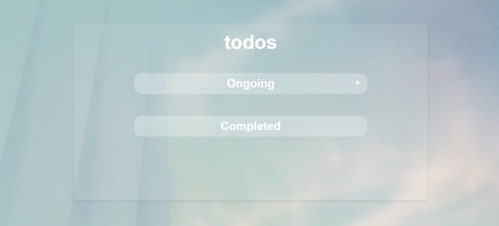
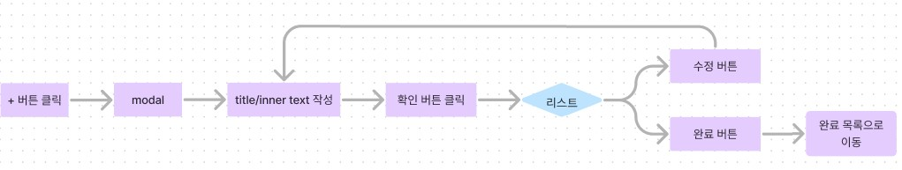

# To do list

패스트캠퍼스 개인 프로젝트 입니다.

## 디자인 정의

대략적인 디자인 레이아웃이라서, 추후에 변경될 가능성이 높습니다.

+ 리스트가 생성되기 전에는 todos, 진행중(과 추가버튼), 완료 만 보여집니다.
+ 새로고침해도 데이터가 유지됩니다.
+ 버튼 부분에 마우스를 대면 커서 모양이 변경됩니다.
+ 버튼 부분에 마우스를 대면 color 가 변경됩니다.
+ 기본적으로 리스트는 flex 정렬 속성을 가집니다.
+ 리스트에 마우스를 댈 시 해당 영역에 hover 속성으로 줘서 디자인이 변경 됩니다.

## 기능 정의

+ 진행중인 목록

    + 리스트 생성
        + `+` 버튼을 클릭 합니다.
        + 클릭하면 모달창이 뜹니다. 모달창에 대제목과 내용을 입력 후 추가 버튼을 누릅니다.

    + 내용 확인
        + 원하는 리스트 영역을 클릭하면 모달창이 뜨면서 입력한 내용을 확인 할 수 있습니다.

    + 완료
        + 생성된 리스트의 완료 버튼을 누르면 해당 리스트가 완료된 목록으로 이동됩니다.
        이동된 목록은 더이상 수정과 삭제가 불가능합니다.

+ 추가될 수 있는 기능

    + 완료된 목록의 리스트를 삭제 할 수 있게 됩니다.

    + 진행중인 목록의 리스트의 내용을 수정 할 수 있게 됩니다.
        + 생성된 리스트의 수정 버튼을 누르면 수정 가능한 모달창이 뜹니다.
        + 내용을 수정 후 완료 버튼을 누르면 수정됩니다.

